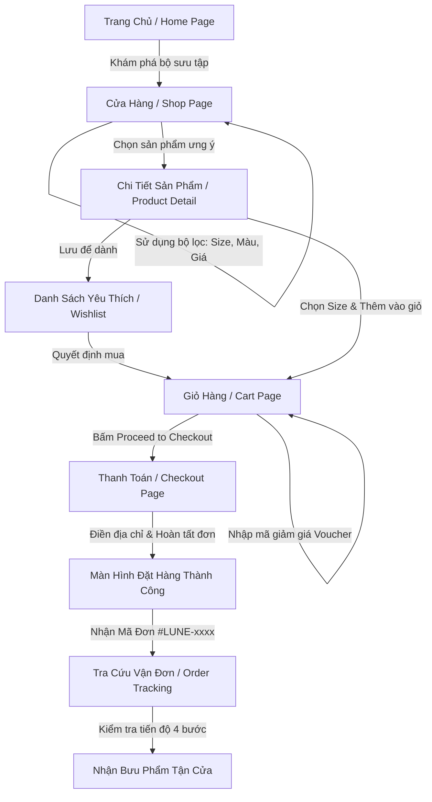
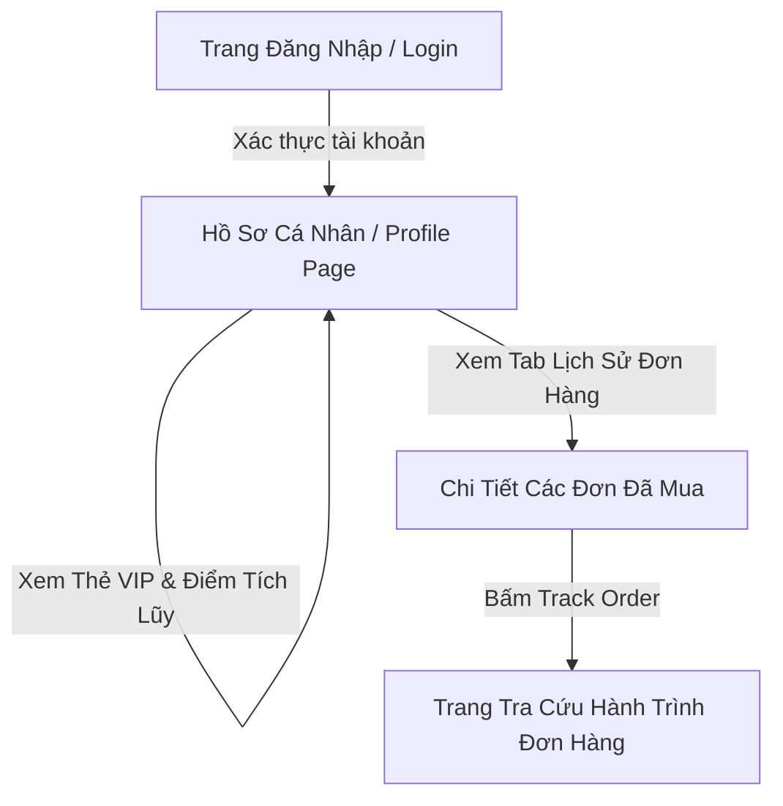
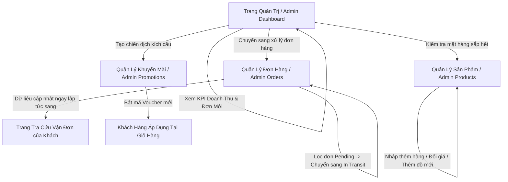

# TÀI LIỆU HƯỚNG DẪN SỬ DỤNG VÀ PHÂN TÍCH TẤT CẢ CÁC TRANG GIAO DIỆN
## HỆ THỐNG THƯƠNG MẠI ĐIỆN TỬ THỜI TRANG CAO CẤP — LUNE MAISON

---

## MỤC LỤC TỔNG QUAN

1. [Giới thiệu Hệ thống & Kiến trúc Giao diện](#1-giới-thiệu-hệ-thống--kiến-trúc-giao-diện)
2. [Phân hệ I: Giao diện Khách hàng (Storefront - 10 Trang)](#2-phân-hệ-i-giao-diện-khách-hàng-storefront)
   - [Trang 01: Trang chủ (Home Page)](#trang-01-trang-chủ-home-page)
   - [Trang 02: Cửa hàng & Bộ lọc sản phẩm (Shop / Catalog Page)](#trang-02-cửa-hàng--bộ-lọc-sản-phẩm-shop--catalog-page)
   - [Trang 03: Chi tiết sản phẩm (Product Detail Page)](#trang-03-chi-tiết-sản-phẩm-product-detail-page)
   - [Trang 04: Giỏ hàng mua sắm (Shopping Bag / Cart Page)](#trang-04-giỏ-hàng-mua-sắm-shopping-bag--cart-page)
   - [Trang 05: Thanh toán & Đặt hàng (Express Atelier Checkout Page)](#trang-05-thanh-toán--đặt-hàng-express-atelier-checkout-page)
   - [Trang 06: Danh sách yêu thích (Wishlist Page)](#trang-06-danh-sách-yêu-thích-wishlist-page)
   - [Trang 07: Xác thực tài khoản (Login & Register Pages)](#trang-07-xác-thực-tài-khoản-login--register-pages)
   - [Trang 08: Tài khoản & Hồ sơ cá nhân (My Atelier Account / Profile Page)](#trang-08-tài-khoản--hồ-sơ-cá-nhân-my-atelier-account--profile-page)
   - [Trang 09: Tra cứu hành trình đơn hàng (Order Tracking Page)](#trang-09-tra-cứu-hành-trình-đơn-hàng-order-tracking-page)
   - [Trang 10: Giới thiệu thương hiệu (About Us Page)](#trang-10-giới-thiệu-thương-hiệu-about-us-page)
3. [Phân hệ II: Bộ công cụ Quản trị viên (Admin Management Suite - 5 Trang)](#3-phân-hệ-ii-bộ-công-cụ-quản-trị-viên-admin-management-suite)
   - [Trang 11: Tổng quan điều hành (Admin Dashboard Page)](#trang-11-tổng-quan-điều-hành-admin-dashboard-page)
   - [Trang 12: Quản lý sản phẩm (Admin Products Page)](#trang-12-quản-lý-sản-phẩm-admin-products-page)
   - [Trang 13: Quản lý danh mục & Bộ sưu tập (Admin Categories Page)](#trang-13-quản-lý-danh-mục--bộ-sưu-tập-admin-categories-page)
   - [Trang 14: Quản lý & Vận đơn (Admin Orders & Fulfillment Page)](#trang-14-quản-lý--vận-đơn-admin-orders--fulfillment-page)
   - [Trang 15: Quản lý khuyến mãi & Voucher (Admin Promotions Page)](#trang-15-quản-lý-khuyến-mãi--voucher-admin-promotions-page)
4. [Sơ đồ Luồng trải nghiệm người dùng (End-to-End User Journeys)](#4-sơ-đồ-luồng-trải-nghiệm-người-dùng-end-to-end-user-journeys)
5. [Ma trận Đánh giá & Phân tích Trải nghiệm người dùng (UX Matrix)](#5-ma-trận-đánh-giá--phân-tích-trải-nghiệm-người-dùng-ux-matrix)

---

## 1. GIỚI THIỆU HỆ THỐNG & KIẾN TRÚC GIAO DIỆN

Hệ thống **LUNE Maison** là nền tảng thương mại điện tử chuyên biệt dành cho thương hiệu thời trang thiết kế cao cấp mang phong cách Parisian Chic sang trọng, thanh lịch. 

Giao diện được phân bổ thành **2 phân hệ hoàn chỉnh**:
1. **Phân hệ Storefront (Dành cho Khách hàng)**: Tập trung vào trải nghiệm thị giác ấn tượng, mượt mà, định vị thương hiệu tinh tế, thao tác mua sắm nhanh gọn và dịch vụ chăm sóc hậu mãi (tra cứu đơn hàng, tích điểm đặc quyền).
2. **Phân hệ Admin Suite (Dành cho Nhà quản trị Atelier)**: Cung cấp trung tâm điều hành tinh gọn, tập trung kiểm soát doanh thu, vòng đời đơn hàng, dữ liệu danh mục hàng may mặc và chiến lược tiếp thị ưu đãi.

---

## 2. PHÂN HỆ I: GIAO DIỆN KHÁCH HÀNG (STOREFRONT)

---

### TRANG 01: TRANG CHỦ (HOME PAGE)
- **Đường dẫn truy cập**: `/`
- **Mục tiêu trang**: Là bộ mặt của thương hiệu, tạo ấn tượng sang trọng đầu tiên, kích thích người dùng khám phá các bộ sưu tập mới nhất (Autumn/Winter 2026) và định hướng luồng mua sắm.

#### Bố cục giao diện & Các thành phần chính:
1. **Thanh điều hướng toàn trang (Global Navigation Bar)**:
   - Logo thương hiệu LUNE Maison nổi bật ở vị trí trung tâm.
   - Menu điều hướng nhanh: *New In, Collection, Ready-to-Wear, Atelier, About*.
   - Khối tiện ích góc phải: Nút tìm kiếm nhanh, Biểu tượng Wishlist (hiển thị số đếm món đồ đã thích), Biểu tượng Giỏ hàng (hiển thị số lượng sản phẩm đang có), Nút Đăng nhập/Tài khoản và Nút chuyển nhanh vào trang Admin.
2. **Khu vực Hero Banner (Editorial Showcase)**:
   - Banner khổ lớn phong cách tạp chí thời trang Châu Âu với thông điệp bộ sưu tập mới.
   - Nút kêu gọi hành động (Call To Action - CTA): *"DISCOVER COLLECTION"* dẫn trực tiếp đến Cửa hàng.
3. **Khu vực Danh mục nổi bật (Curated Categories)**:
   - Thẻ hình ảnh đại diện cho các dòng sản phẩm chủ lực: Áo khoác ngoài (Outerwear), Đầm lụa (Silk Dresses), Âu phục may đo (Tailoring), Đồ len Cashmere (Knitwear).
   - Click vào từng thẻ sẽ tự động chuyển hướng và áp dụng bộ lọc tương ứng tại Cửa hàng.
4. **Khu vực Sản phẩm mới & Bán chạy (New Arrivals & Bestsellers)**:
   - Lưới hiển thị các sản phẩm tiêu biểu với hiệu ứng hình ảnh tự động đổi góc nhìn khi rê chuột (Hover view).
   - Thẻ nhãn nhận diện: *NEW ARRIVAL, BESTSELLER, RUNWAY*.
5. **Khu vực Câu chuyện thương hiệu (Atelier Philosophy Section)**:
   - Trích dẫn triết lý thiết kế thủ công, sự kết hợp giữa chất liệu bền vững và đường may kinh điển.
6. **Khối Đăng ký nhận tin đặc quyền (Newsletter Subscription)**:
   - Ô nhập email nhận bản tin riêng tư và mã giảm giá chào mừng dành cho khách hàng mới.
7. **Chân trang thương hiệu (Footer)**:
   - Liên kết chính sách giao nhận, bảo hành, bảng hướng dẫn chọn kích cỡ (Size Guide), thông tin liên hệ và mạng xã hội.

#### Hướng dẫn sử dụng:
- **Người dùng mới**: Cuộn trang từ trên xuống dưới để nắm bắt tinh thần bộ sưu tập; nhấp chuột vào *"DISCOVER COLLECTION"* để vào xem toàn bộ sản phẩm.
- **Tìm kiếm đồ theo nhu cầu**: Nhấp trực tiếp vào danh mục hình ảnh (ví dụ: nhấp vào hình *Silk Dresses*) để hệ thống mở trang Cửa hàng đã lọc sẵn đầm lụa.
- **Thao tác nhanh**: Rê chuột lên từng sản phẩm ở mục Bestseller, nhấp biểu tượng **Trái tim** để lưu vào mục yêu thích hoặc nhấp vào ảnh để vào trang chi tiết.

---

### TRANG 02: CỬA HÀNG & BỘ LỌC SẢN PHẨM (SHOP / CATALOG PAGE)
- **Đường dẫn truy cập**: `/shop`
- **Mục tiêu trang**: Trưng bày toàn bộ danh mục sản phẩm thời trang, hỗ trợ công cụ tìm kiếm và bộ lọc đa chiều giúp khách hàng dễ dàng tìm đúng món đồ theo màu sắc, kích cỡ, mức giá và danh mục.

#### Bố cục giao diện & Các thành phần chính:
1. **Thanh chỉ mục (Breadcrumb) & Tiêu đề danh mục**:
   - Hiển thị vị trí người dùng (`Home / Shop / All Garments`) và tổng số lượng sản phẩm phù hợp.
2. **Cột lọc chuyên sâu bên trái (Desktop Sidebar Filter) / Modal lọc trên thiết bị di động**:
   - **Bộ lọc theo Phân loại (Categories)**: Tất cả đồ, Áo khoác dạ, Đầm lụa, Áo Blazer may đo, Len dệt kim Cashmere, Quần xếp ly, Phụ kiện da cao cấp.
   - **Bộ lọc theo Kích cỡ (Size Selector)**: Các nút chọn chuẩn quốc tế: *XS, S, M, L, XL*.
   - **Bộ lọc theo Bảng màu (Color Swatches)**: Các ô màu thực tế đại diện cho chất liệu (Caramel, Beige kem, Nâu ấm, Nâu Espresso đậm,...).
   - **Thanh trượt giới hạn giá (Price Range Slider)**: Kéo trượt điều chỉnh mức giá tối đa từ $0 đến $400+.
   - **Nút làm mới bộ lọc (Reset Filter)**: Khôi phục tất cả lựa chọn về trạng thái mặc định ban đầu.
3. **Thanh điều khiển sắp xếp (Sort Controls)**:
   - Menu thả xuống cho phép xếp theo: *Đặc sắc nhất (Featured), Giá từ thấp đến cao (Price: Low to High), Giá từ cao đến thấp (Price: High to Low), Hàng mới về nhất (Newest)*.
4. **Lưới thẻ sản phẩm (Product Grid)**:
   - Mỗi thẻ hiển thị: Ảnh bìa sản phẩm sắc nét, Tên sản phẩm, Dòng phân loại, Giá niêm yết, Bảng các màu có sẵn dạng chấm màu tròn, Nút icon Trái tim (Thêm vào Wishlist), và nút *"Quick Add to Bag"* (Thêm nhanh vào giỏ).

#### Hướng dẫn sử dụng:
1. **Tìm kiếm & Lọc đồ**:
   - Nhấp vào danh mục bạn cần tìm (ví dụ: *Blazers & Tailoring*).
   - Chọn kích cỡ cơ thể của bạn (ví dụ: size *M*).
   - Kéo thanh giá để giới hạn ngân sách mong muốn. Lưới sản phẩm bên phải sẽ ngay lập tức tự động cập nhật mà không cần tải lại trang.
2. **Sắp xếp theo ý muốn**:
   - Chọn tùy chọn sắp xếp tại góc phải trên cùng để ưu tiên xem các món có giá mềm trước hoặc các thiết kế mới nhất.
3. **Thao tác nhanh trên sản phẩm**:
   - Nhấp trực tiếp vào tên hoặc hình ảnh để vào trang xem chi tiết chất liệu và hình ảnh phóng to.
   - Nhấp vào nút *"Quick Add"* nếu bạn muốn bỏ ngay sản phẩm vào giỏ hàng với thông số mặc định.

---

### TRANG 03: CHI TIẾT SẢN PHẨM (PRODUCT DETAIL PAGE)
- **Đường dẫn truy cập**: `/product/:id` (ví dụ: `/product/1`)
- **Mục tiêu trang**: Cung cấp bức tranh toàn cảnh về sản phẩm, kích thích quyết định mua hàng thông qua hình ảnh chi tiết, mô tả chất liệu tinh xảo, tư vấn kích cỡ và đánh giá người dùng thực tế.

#### Bố cục giao diện & Các thành phần chính:
1. **Thư viện ảnh sản phẩm (Interactive Image Gallery)**:
   - Ảnh chính kích thước lớn với độ phân giải cao, thể hiện rõ bề mặt vải và đường chỉ may.
   - Dải ảnh thu nhỏ (Thumbnails) chụp các góc độ khác nhau: phía trước, phía sau, chụp cận cảnh ve áo hoặc cúc áo.
2. **Khối thông tin sản phẩm (Product Identity)**:
   - Tên sản phẩm, dòng bộ sưu tập, mã định danh, tình trạng còn hàng (*In Stock / Low Stock*).
   - Mức giá bán, nhãn giảm giá (nếu có khuyến mãi).
3. **Bộ tùy chỉnh thông số (Customization Options)**:
   - **Bảng chọn màu sắc (Color Selector)**: Hiển thị tên màu kèm nút tròn chọn màu trực quan.
   - **Bảng chọn kích thước (Size Picker)**: Các ô chọn size kèm liên kết *"Size Guide"* (hướng dẫn số đo 3 vòng chi tiết).
   - **Bộ điều chỉnh số lượng (Quantity Counter)**: Các nút bấm `+` và `-` để chọn số lượng mong muốn.
4. **Hành động mua sắm (Action CTAs)**:
   - Nút lớn **"ADD TO SHOPPING BAG"**: Thêm món đồ vào giỏ và tiếp tục xem hàng.
   - Nút **"BUY NOW / CHECKOUT"**: Chuyển thẳng sang trang thanh toán tức thì.
   - Nút biểu tượng **Trái tim**: Lưu vào danh sách ước muốn cá nhân.
5. **Thông tin cam kết & Hậu mãi (Maison Guarantees)**:
   - Miễn phí đóng gói hộp quà đặc quyền Atelier, miễn phí vận chuyển cho đơn tiêu chuẩn, cam kết đổi trả trong 30 ngày.
6. **Mô tả chi tiết & Hướng dẫn bảo quản**:
   - Thông số thành phần sợi vải (Ví dụ: 100% Lụa Mulberry, Lớp lót Viscose).
   - Hướng dẫn giặt hấp chuyên nghiệp để giữ form dáng.
7. **Khu vực Đánh giá khách hàng (Client Reviews & Rating)**:
   - Điểm số trung bình (Ví dụ: 4.9/5 sao) kèm tỷ lệ hài lòng.
   - Các bài nhận xét thực tế từ khách hàng đã mua về form dáng, chất vải và thời gian giao hàng.
8. **Khối gợi ý phối đồ (Complete The Look / Related Garments)**:
   - Giới thiệu các món đồ mặc kèm phù hợp (ví dụ: xem áo vest thì gợi ý thêm quần âu cùng bộ hoặc sơ mi lụa bên trong).

#### Hướng dẫn sử dụng:
1. Nhấp chuột vào các ảnh thu nhỏ ở góc trái để kiểm tra kỹ các góc chụp của món đồ.
2. Lần lượt bấm chọn **Màu sắc** và **Kích cỡ (Size)** tương ứng với vóc dáng của bạn.
3. Chọn số lượng cần mua (mặc định là 1).
4. Nhấp nút **"ADD TO SHOPPING BAG"**; một thông báo xác nhận sẽ xuất hiện và số đếm trên biểu tượng giỏ hàng ở thanh Menu sẽ tăng lên.
5. Cuộn xuống dưới để đọc đánh giá của những người mua trước hoặc bấm vào các sản phẩm gợi ý bên dưới để xem thêm đồ phối cùng.

---

### TRANG 04: GIỎ HÀNG MUA SẮM (SHOPPING BAG / CART PAGE)
- **Đường dẫn truy cập**: `/cart`
- **Mục tiêu trang**: Giúp khách hàng kiểm tra lại danh sách các món đồ đã lựa chọn, điều chỉnh số lượng, áp dụng mã ưu đãi/voucher giảm giá và tính toán trước chi phí vận chuyển.

#### Bố cục giao diện & Các thành phần chính:
1. **Bảng danh sách sản phẩm trong giỏ (Cart Items Table)**:
   - Hình ảnh thu nhỏ, tên sản phẩm, phân loại màu sắc và kích cỡ đã chọn.
   - Đơn giá niêm yết cho từng món.
   - Cột điều chỉnh số lượng: Bộ nút tăng/giảm (`-`, `+`) và ô nhập số trực tiếp.
   - Tổng tiền từng dòng (Subtotal = Đơn giá × Số lượng).
   - Nút biểu tượng **Thùng rác** để xóa bỏ món đồ khỏi giỏ hàng.
2. **Khối công cụ Mã giảm giá (Privilege Voucher Code)**:
   - Ô nhập mã ưu đãi (Ví dụ: nhập mã khuyến mãi nhận từ email hoặc chương trình tri ân).
   - Nút **"APPLY"**: Hệ thống lập tức kiểm tra và phản hồi trạng thái: Áp dụng thành công (hiển thị số tiền được khấu trừ) hoặc thông báo nếu mã không tồn tại / hết hạn.
3. **Khối tóm tắt đơn hàng (Order Summary Box)**:
   - **Tạm tính (Subtotal)**: Tổng giá trị hàng hóa thực tế.
   - **Khấu trừ ưu đãi (Voucher Discount)**: Số tiền được giảm tương ứng với mã đã nhập.
   - **Chi phí vận chuyển (Worldwide Delivery)**: Tự động miễn phí vận chuyển nếu đơn hàng đạt điều kiện hạn mức (ví dụ trên $250) hoặc ghi nhận mức phí tiêu chuẩn $25.
   - **Tổng thanh toán (Final Total)**: Số tiền thanh toán cuối cùng hiển thị nổi bật.
4. **Nút điều hướng hành động**:
   - Nút **"PROCEED TO CHECKOUT"**: Nút bấm màu vàng kim/đen sang trọng đưa người dùng sang bước điền thông tin giao hàng.
   - Nút **"Continue Shopping"**: Quay lại trang Cửa hàng để lựa chọn thêm sản phẩm khác mà vẫn giữ nguyên giỏ hàng.
5. **Trạng thái giỏ hàng trống (Empty State)**:
   - Nếu chưa có món đồ nào, trang sẽ hiển thị thông báo dịu dàng *"Your bag is currently empty"* kèm nút bấm dẫn quay lại trang Cửa hàng.

#### Hướng dẫn sử dụng:
1. Kiểm tra lại danh sách sản phẩm, đảm bảo đúng màu và size bạn mong muốn.
2. Nếu muốn mua thêm số lượng cho người thân, nhấn vào dấu `+` tương ứng. Tổng tiền sẽ tự động nhân lên tức thì.
3. Nếu có mã quà tặng (ví dụ `ATELIER15` hoặc `FREESHIP`), gõ mã vào ô *"Enter privilege code"* rồi bấm **"Apply"** để nhận chiết khấu.
4. Kiểm tra số tiền tổng kết cuối cùng tại ô **Total**, sau đó nhấn **"PROCEED TO CHECKOUT"** để tiến hành đặt hàng.

---

### TRANG 05: THANH TOÁN & ĐẶT HÀNG (EXPRESS ATELIER CHECKOUT PAGE)
- **Đường dẫn truy cập**: `/checkout`
- **Mục tiêu trang**: Trang hoàn tất quy trình mua sắm, thu thập thông tin người nhận, địa chỉ giao hàng và phương thức thanh toán an toàn với tốc độ nhanh chóng và tính bảo mật cao.

#### Bố cục giao diện & Các thành phần chính:
1. **Liên kết quay lại (Back Link)**:
   - Dòng liên kết *"Return to Bag"* giúp khách hàng dễ dàng quay lại giỏ hàng nếu cần sửa đổi món đồ.
2. **Khu vực Form thông tin đặt hàng (Cột bên trái)**:
   - **Mục 1: Thông tin liên hệ (Contact Information)**:
     + Ô nhập Địa chỉ Email nhận thông báo xác nhận đơn và mã theo dõi bưu kiện.
   - **Mục 2: Địa chỉ giao hàng (Shipping Address)**:
     + Họ và Tên người nhận (First Name, Last Name).
     + Địa chỉ đường phố, số nhà, căn hộ (Street Address).
     + Thành phố / Tỉnh thành (City).
     + Mã bưu chính / Postal Code.
   - **Mục 3: Phương thức thanh toán (Payment Method)**:
     + Thông báo bảo mật mã hóa SSL 256-bit.
     + Thông tin chế độ trải nghiệm minh bạch (Demo Payment Mode).
   - **Nút xác nhận đặt hàng (Order Submission)**:
     + Nút lớn: *"COMPLETE ORDER — $[Tổng tiền]"*.
3. **Cột tóm lược đơn hàng bên phải (Sticky Order Summary)**:
   - Liệt kê tóm tắt từng món đồ (Tên, Size, Số lượng, Giá tiền).
   - Phí giao hàng quốc tế (Complimentary / $25).
   - Dòng chiết khấu đặc quyền Privilege nếu có áp dụng voucher.
   - Tổng số tiền chốt phải trả.
4. **Màn hình xác nhận thành công (Order Confirmed View)**:
   - Sau khi bấm hoàn tất, giao diện chuyển sang trạng thái chúc mừng: Biểu tượng tích xanh bảo chứng, Dòng chữ tri ân *"Merci Beaucoup"*, Mã số đơn hàng chính thức (ví dụ: `#LUNE-2026-8941`), lời nhắc kiểm tra email và nút *"Return to Homepage"*.

#### Hướng dẫn sử dụng:
1. Điền chính xác email liên hệ để hệ thống gửi hóa đơn điện tử.
2. Nhập đầy đủ họ tên, địa chỉ số nhà, tên thành phố và mã bưu cục nhận hàng.
3. Rà soát lại bảng tóm tắt sản phẩm ở cột bên phải.
4. Nhấn nút **"COMPLETE ORDER"**.
5. Nhận mã đơn hàng hiển thị trên màn hình và ghi lại mã này để sử dụng cho tính năng tra cứu đơn hàng sau này.

---

### TRANG 06: DANH SÁCH YÊU THÍCH (WISHLIST PAGE)
- **Đường dẫn truy cập**: `/wishlist`
- **Mục tiêu trang**: Nơi lưu giữ những thiết kế khách hàng yêu thích nhưng chưa mua ngay, tạo cơ hội tái tương tác và thúc đẩy mua hàng trong tương lai.

#### Bố cục giao diện & Các thành phần chính:
1. **Tiêu đề trang & Đếm số lượng**:
   - Dòng chữ giới thiệu *"Saved For Later / Atelier Wishlist"* kèm số lượng món đồ đang được lưu.
2. **Lưới sản phẩm yêu thích (Wishlist Grid)**:
   - Hình ảnh, tên thiết kế, giá bán hiện tại và trạng thái kho hàng.
   - **Nút "Move to Bag" (Chuyển vào giỏ hàng)**: Bấm 1 chạm để chuyển ngay sản phẩm vào giỏ hàng phục vụ việc thanh toán.
   - **Nút "Remove" (Xóa bỏ)**: Gỡ sản phẩm khỏi danh sách yêu thích khi không còn nhu cầu.
3. **Trạng thái danh sách rỗng (Empty Wishlist)**:
   - Thông điệp khuyến khích khám phá thời trang khi chưa có sản phẩm nào được lưu trữ, kèm nút quay về trang Cửa hàng.

#### Hướng dẫn sử dụng:
- Khi đang lướt bất kỳ trang nào (Trang chủ, Cửa hàng, Chi tiết sản phẩm), hãy bấm vào biểu tượng **Trái tim** để đưa món đồ vào đây.
- Khi đã sẵn sàng mua sắm, truy cập biểu tượng Trái tim trên thanh Menu chính, tìm món đồ ưng ý và bấm **"Move to Bag"**.

---

### TRANG 07: XÁC THỰC TÀI KHOẢN (LOGIN & REGISTER PAGES)
- **Đường dẫn truy cập**: `/login` (Đăng nhập) và `/register` (Đăng ký)
- **Mục tiêu trang**: Đảm bảo quyền riêng tư và danh tính của khách hàng, tích hợp chương trình khách hàng thân thiết Atelier Privilège Club và cá nhân hóa lịch sử mua sắm.

#### Bố cục giao diện & Các thành phần chính:
1. **Thiết kế phong cách Editorial tối giản**:
   - Khung xác thực đặt tại trung tâm màn hình với gam màu be ấm, phông chữ thanh lịch, tránh sự rối mắt.
2. **Giao diện Đăng nhập (`/login`)**:
   - Ô nhập Địa chỉ Email hoặc Tên đăng nhập.
   - Ô nhập Mật khẩu kèm tùy chọn ẩn/hiện mật khẩu bảo mật.
   - Liên kết *"Forgot Password?"* (Quên mật khẩu).
   - Nút đăng nhập chính: **"SIGN IN TO ATELIER"**.
   - Dòng chuyển hướng: *"Don't have an account? Create one"* (Dẫn sang trang Đăng ký).
3. **Giao diện Đăng ký (`/register`)**:
   - Ô nhập Họ và Tên đầy đủ.
   - Ô nhập Địa chỉ Email cá nhân.
   - Ô nhập Mật khẩu và Xác nhận lại mật khẩu.
   - Hộp chọn đồng ý với điều khoản dịch vụ và chính sách thành viên Privilège.
   - Nút đăng ký chính: **"CREATE ATELIER ACCOUNT"**.
   - Dòng chuyển hướng: *"Already a member? Sign in"*.
4. **Tùy chọn Đăng nhập mạng xã hội (Social Login)**:
   - Các nút liên kết tài khoản nhanh với Google và Apple ID.

#### Hướng dẫn sử dụng:
- **Đăng ký tài khoản mới**: Nhấp vào liên kết Create Account, điền tên, email và mật khẩu rồi bấm Đăng ký để trở thành thành viên.
- **Đăng nhập**: Điền thông tin tài khoản đã đăng ký và nhấn Sign In. Hệ thống sẽ tự động đồng bộ giỏ hàng và danh sách yêu thích của bạn.

---

### TRANG 08: TÀI KHOẢN & HỒ SƠ CÁ NHÂN (MY ATELIER ACCOUNT / PROFILE PAGE)
- **Đường dẫn truy cập**: `/profile`
- **Mục tiêu trang**: Trung tâm quản lý thông tin khách hàng, hạng thẻ hội viên đặc quyền, điểm thưởng tích lũy và tra cứu toàn bộ lịch sử các đơn hàng đã đặt.

#### Bố cục giao diện & Các thành phần chính:
1. **Thẻ định danh thành viên (Profile Hero Card)**:
   - Khung hình đại diện với chữ cái viết tắt tên người dùng.
   - Tên khách hàng (Ví dụ: *Eleanor Vance*).
   - Huy hiệu hạng hội viên hoàng gia: **"VIP Privilège Member"** kèm biểu tượng Vương miện (Crown).
   - Thông tin ngày gia nhập và điểm thưởng tích lũy hiện có (Ví dụ: *1,250 Points*).
2. **Cột điều hướng tính năng (Left Sidebar Tabs)**:
   - Tab 1: **Personal Details** (Thông tin tài khoản cá nhân).
   - Tab 2: **Order History** (Lịch sử các đơn hàng).
   - Tab 3: **Shipping Addresses** (Sổ địa chỉ nhận hàng).
   - Tab 4: **Security & Password** (Bảo mật & Đổi mật khẩu).
   - Nút **"Sign Out"** (Đăng xuất an toàn).
3. **Nội dung Tab 1: Thông tin cá nhân (Details View)**:
   - Form cho phép cập nhật: Họ tên, Số điện thoại, Email, Ngày sinh.
   - Nút bấm **"Save Profile Changes"** với thông báo trạng thái cập nhật thành công dạng thẻ Toast xanh.
4. **Nội dung Tab 2: Lịch sử đơn hàng (Order History View)**:
   - Danh sách các đơn hàng đã thực hiện kèm mã đơn (Ví dụ: `#LUNE-8941`), ngày tạo đơn, tổng giá trị thanh toán.
   - Nhãn trạng thái đơn hàng trực quan: *Delivered (Đã giao), In Transit (Đang vận chuyển), Processing (Đang may đo/đóng gói)*.
   - Nút **"Track Order"** cho phép chuyển thẳng sang trang Tra cứu hành trình với mã đơn tương ứng.

#### Hướng dẫn sử dụng:
1. Để đổi thông tin liên lạc: Chọn tab *Personal Details*, chỉnh sửa số điện thoại hoặc email rồi nhấn *Save Changes*.
2. Để xem lại các món đồ đã từng mua: Chọn tab *Order History*, nhấp vào nút xem chi tiết đơn để kiểm tra lại ngày mua và số tiền.
3. Để theo dõi bưu kiện đang trên đường giao: Nhấn vào liên kết *Track Order* ngay cạnh đơn hàng cần theo dõi.

---

### TRANG 09: TRA CỨU HÀNH TRÌNH ĐƠN HÀNG (ORDER TRACKING PAGE)
- **Đường dẫn truy cập**: `/order-tracking`
- **Mục tiêu trang**: Đem lại sự an tâm tuyệt đối cho khách hàng cao cấp bằng việc minh bạch hóa từng công đoạn chế tác thủ công, đóng gói và vận chuyển bưu phẩm quốc tế.

#### Bố cục giao diện & Các thành phần chính:
1. **Khối tìm kiếm vận đơn (Tracking Lookup Bar)**:
   - Ô nhập mã số đơn hàng (Ví dụ: `LUNE-8941`).
   - Nút bấm biểu tượng Kính lúp / Nút **"Track"** để kích hoạt truy vấn dữ liệu vận chuyển.
2. **Tiến trình trạng thái 4 giai đoạn trực quan (Visual Timeline Progression)**:
   - **Giai đoạn 1: Order Confirmed (Đơn hàng xác nhận)**: Khoản thanh toán đã được duyệt và chuyển tiếp đến xưởng may đo Paris.
   - **Giai đoạn 2: Atelier Tailoring & Preparation (May đo & Kiểm định)**: Sản phẩm được thợ thủ công kiểm tra chất lượng, ủi nhiệt và đóng gói trong hộp quà nhận diện thương hiệu.
   - **Giai đoạn 3: Dispatched & In Transit (Đã xuất xưởng & Đang vận chuyển)**: Bưu phẩm đã rời trung tâm trung chuyển và được vận chuyển bằng đường hàng không thông qua đơn vị vận tải quốc tế.
   - **Giai đoạn 4: Out for Delivery (Đang phát tận tay)**: Nhân viên chuyển phát liên hệ giao hàng tận cửa kèm chữ ký xác nhận của khách hàng.
   - Mỗi giai đoạn đều hiển thị dấu tích hoàn thành màu xanh hoặc vòng tròn nhấp nháy chỉ giai đoạn đang diễn ra kèm mốc thời gian chi tiết (ngày, giờ).
3. **Thẻ tóm tắt thông tin bưu gửi (Consignment Card)**:
   - Đơn vị vận chuyển liên kết (Ví dụ: *DHL Express Worldwide*).
   - Mã vận đơn quốc tế.
   - Địa chỉ đích đến dự kiến.
   - Danh sách tóm lược các trang phục nằm trong gói hàng.

#### Hướng dẫn sử dụng:
1. Khách hàng nhập mã số đơn hàng nhận được từ trang Thanh toán hoặc trong Email xác nhận vào ô tìm kiếm.
2. Nhấn nút tìm kiếm; hệ thống sẽ hiển thị biểu đồ dòng thời gian cho biết bưu kiện đang nằm ở chặng nào.
3. Xem ngày dự kiến giao hàng để sắp xếp thời gian nhận bưu phẩm tại nhà.

---

### TRANG 10: GIỚI THIỆU THƯƠNG HIỆU (ABOUT US PAGE)
- **Đường dẫn truy cập**: `/about`
- **Mục tiêu trang**: Kể câu chuyện di sản, tôn vinh kỹ nghệ thủ công, xây dựng lòng tin thương hiệu và cung cấp thông tin liên hệ các cửa hàng Flagship trên thế giới.

#### Bố cục giao diện & Các thành phần chính:
1. **Phần Hero Giới thiệu**:
   - Khẩu hiệu nghệ thuật của LUNE Maison: Sự giao thoa giữa thời trang bền vững và phong cách sống thượng lưu.
2. **Các khối nội dung cốt lõi**:
   - **Kỹ nghệ xưởng may (The Atelier Legacy)**: Giới thiệu quy trình dệt lụa tự nhiên, len cashmere tuyển chọn và quy chuẩn may đo chuẩn mực.
   - **Tính bền vững (Sustainable Commitment)**: Cam kết không rác thải nhựa trong bao bì đóng gói và bảo tồn nghề thủ công truyền thống.
   - **Hệ thống cửa hàng trải nghiệm (Flagship Salons)**: Địa chỉ các showroom trưng bày chính tại Paris, Milan, Tokyo và New York.
3. **Thông tin dịch vụ trợ giúp khách hàng đặc quyền (Concierge Desk)**:
   - Đường dây nóng hỗ trợ riêng, email hẹn lịch thử đồ may đo trực tiếp tại xưởng.

#### Hướng dẫn sử dụng:
- Dành cho khách hàng mới muốn tìm hiểu sâu về nguồn gốc chất liệu và giá trị thương hiệu trước khi đưa ra quyết định mua sắm các sản phẩm cao cấp.

---

## 3. PHÂN HỆ II: BỘ CÔNG CỤ QUẢN TRỊ VIÊN (ADMIN MANAGEMENT SUITE)

---

### TRANG 11: TỔNG QUAN ĐIỀU HÀNH (ADMIN DASHBOARD PAGE)
- **Đường dẫn truy cập**: `/admin`
- **Mục tiêu trang**: Bảng điều khiển trung tâm dành cho Giám đốc điều hành Atelier, phản ánh sức khỏe tài chính, khối lượng đơn hàng và các hoạt động kinh doanh hàng ngày.

#### Bố cục giao diện & Các thành phần chính:
1. **Thanh Menu Quản trị cố định (Admin Sidebar Navigation)**:
   - Logo thương hiệu LUNE Atelier kèm nhãn quyền Admin.
   - Danh sách các màn hình nghiệp vụ: *Executive Dashboard, Products, Categories, Orders & Fulfillment, Promotions*.
   - Nút chuyển nhanh ra ngoài giao diện bán hàng (*"View Storefront"*) và nút Đăng xuất.
2. **Khối Banner Chào mừng (Welcome Banner)**:
   - Lời chào cá nhân hóa *"Welcome back, Atelier Director"*, định vị mùa thời trang hiện tại.
   - Nút lối tắt: *"MANAGE CATALOG"* đưa thẳng tới kho sản phẩm.
3. **Hệ thống 4 Thẻ chỉ số hiệu suất trọng yếu (Metric KPI Cards)**:
   - **Thẻ 1 - Doanh thu gộp (Gross Revenue)**: Hiển thị tổng doanh thu lũy kế (Ví dụ: `$148,920`) cùng % tăng trưởng so với tháng trước (+18.4%).
   - **Thẻ 2 - Tổng đơn đặt hàng (Total Orders)**: Số lượng đơn hàng đã phát sinh (Ví dụ: `642 Orders`) cùng chỉ số tăng trưởng đơn (+12.1%).
   - **Thẻ 3 - Danh mục hàng đang bán (Garments in Catalog)**: Tổng số mẫu thiết kế đang active trong kho kèm cảnh báo các mẫu sắp hết hàng.
   - **Thẻ 4 - Lượng khách hàng mới (New Clients)**: Số lượng thành viên đăng ký mới trong tháng.
4. **Biểu đồ doanh thu tuần (Weekly Revenue Chart)**:
   - Trực quan hóa doanh thu từ Thứ Hai đến Chủ Nhật qua đồ thị cột tinh gọn, cho phép người quản lý nhận diện ngày bán chạy nhất trong tuần.
5. **Bảng đơn hàng mới nhất cần xử lý (Recent Atelier Orders Table)**:
   - Liệt kê 5 đơn hàng vừa phát sinh: Mã đơn, tên khách hàng, tổng tiền, ngày đặt và trạng thái xử lý.
6. **Bảng sản phẩm bán chạy hàng đầu (Top Performing Garments)**:
   - Danh sách các sản phẩm đóng góp doanh số cao nhất cùng số lượng tồn kho còn lại giúp quản lý chủ động kế hoạch may bổ sung.

#### Hướng dẫn sử dụng:
- Quản trị viên truy cập mỗi buổi sáng để nắm bắt tình hình doanh thu ngày và tuần.
- Theo dõi các cảnh báo tồn kho thấp để nhanh chóng chuyển tiếp lệnh sản xuất cho xưởng may.
- Nhấp trực tiếp vào các nút xem chi tiết đơn hàng để chuyển sang khâu đóng gói vận chuyển.

---

### TRANG 12: QUẢN LÝ SẢN PHẨM (ADMIN PRODUCTS PAGE)
- **Đường dẫn truy cập**: `/admin/products`
- **Mục tiêu trang**: Toàn quyền kiểm soát danh mục sản phẩm may mặc của thương hiệu: thêm mới thiết kế, sửa giá bán, cập nhật số lượng tồn kho và xóa sản phẩm lỗi mốt.

#### Bố cục giao diện & Các thành phần chính:
1. **Thanh công cụ đầu trang (Header Toolbar)**:
   - Tiêu đề nghiệp vụ: *Garments & Catalog Management*.
   - Nút bấm chính: **"+ NEW GARMENT"** để mở cửa sổ tạo sản phẩm mới.
2. **Thanh tìm kiếm & Bộ lọc nhanh**:
   - Ô nhập từ khóa tìm kiếm theo tên sản phẩm hoặc mã định danh.
   - Hộp chọn lọc theo Phân loại danh mục (Outerwear, Dresses, Tailoring,...).
   - Hộp chọn lọc theo trạng thái kho (Tất cả, Đang bán, Hết hàng, Sắp hết hàng).
3. **Bảng dữ liệu sản phẩm chi tiết (Products Data Table)**:
   - Cột 1: Ảnh đại diện sản phẩm thu nhỏ sắc nét.
   - Cột 2: Tên sản phẩm, dòng bộ sưu tập và thẻ phân loại.
   - Cột 3: Giá bán niêm yết ($).
   - Cột 4: Số lượng tồn kho thực tế kèm nhãn cảnh báo màu đỏ nếu số lượng < 10.
   - Cột 5: Trạng thái kinh doanh (*Active / Inactive*).
   - Cột 6: Thao tác (Actions) gồm nút **Chỉnh sửa (Edit)** và nút **Xóa (Delete)**.
4. **Cửa sổ Modal Thêm mới / Chỉnh sửa sản phẩm (Product Form Modal)**:
   - Ô nhập Tên trang phục thời trang.
   - Ô chọn Danh mục bộ sưu tập.
   - Ô nhập Giá bán ($) và Số lượng tồn kho khởi tạo.
   - Ô đường dẫn hình ảnh đại diện (Image URL).
   - Ô nhập mô tả chi tiết chất liệu và đường cắt may.
   - Nút **"Save Garment"** để lưu thay đổi và nút **"Cancel"** để đóng modal.
5. **Hệ thống thông báo Toast nổi (Floating Toast Notifications)**:
   - Hiển thị phản hồi tức thì mỗi khi sản phẩm được tạo mới, cập nhật thành công hoặc xóa bỏ khỏi hệ thống.

#### Hướng dẫn sử dụng:
1. **Tìm kiếm sản phẩm**: Gõ tên món đồ vào thanh tìm kiếm; bảng dữ liệu sẽ tự lọc kết quả ngay lập tức.
2. **Thêm sản phẩm mới vào bộ sưu tập**:
   - Nhấn nút **"+ NEW GARMENT"** góc trên bên phải.
   - Nhập đầy đủ thông tin: Tên váy/áo, chọn danh mục tương ứng, nhập giá bán, số lượng trong kho và đường link ảnh.
   - Nhấn **"Save Garment"**; sản phẩm mới sẽ hiển thị ngay tại trang Cửa hàng ngoài storefront cho khách hàng mua.
3. **Cập nhật giá hoặc kho hàng**:
   - Nhấn biểu tượng Bút chì (Edit) tại dòng sản phẩm muốn đổi.
   - Thay đổi mức giá mới hoặc cộng thêm số lượng tồn kho vừa nhập về.
   - Bấm lưu lại.
4. **Xóa sản phẩm**: Nhấn biểu tượng Thùng rác (Delete) tại món đồ cần gỡ bỏ.

---

### TRANG 13: QUẢN LÝ DANH MỤC & BỘ SƯU TẬP (ADMIN CATEGORIES PAGE)
- **Đường dẫn truy cập**: `/admin/categories`
- **Mục tiêu trang**: Phân tầng cấu trúc mặt hàng, phân nhóm các bộ sưu tập theo mùa hoặc theo phong cách thời trang, giúp việc quản lý danh mục ngoài trang chủ có hệ thống và khoa học.

#### Bố cục giao diện & Các thành phần chính:
1. **Thanh tiêu đề & Nút tạo mới**:
   - Nút bấm **"+ NEW CATEGORY"** để mở khung thêm bộ sưu tập mới.
2. **Lưới thẻ bộ sưu tập (Category Cards Grid)**:
   - Mỗi thẻ đại diện cho 1 phân loại (Ví dụ: *Coats & Outerwear, Silk Dresses, Cashmere Knitwear, Leather Goods*).
   - Thể hiện hình ảnh đại diện trang bìa của danh mục.
   - Thống kê số lượng trang phục đang có trong danh mục đó (Ví dụ: `12 Garments Active`).
   - Đường dẫn định danh (Slug URL) thân thiện.
   - Đoạn mô tả định vị phong cách của danh mục.
   - Các nút chức năng: Chỉnh sửa thông tin danh mục hoặc Xóa danh mục rỗng.
3. **Cửa sổ Modal Thêm danh mục mới**:
   - Form nhập: Tên bộ sưu tập mới, Đường dẫn danh mục, Ảnh bìa nghệ thuật, Đoạn mô tả giới thiệu.

#### Hướng dẫn sử dụng:
1. Khi xưởng ra mắt một dòng sản phẩm hoàn toàn mới (ví dụ: *Trang sức Haute Joaillerie*), bấm nút **"+ NEW CATEGORY"**.
2. Điền tên danh mục và tải ảnh bìa đại diện.
3. Lưu lại; danh mục mới này sẽ xuất hiện trên menu bộ lọc trang Cửa hàng của khách hàng.

---

### TRANG 14: QUẢN LÝ & VẬN ĐƠN (ADMIN ORDERS & FULFILLMENT PAGE)
- **Đường dẫn truy cập**: `/admin/orders`
- **Mục tiêu trang**: Quản lý vòng đời đơn hàng từ lúc khách đặt mua, đóng gói tại xưởng, bàn giao hãng vận chuyển cho đến khi bưu phẩm được ký nhận an toàn.

#### Bố cục giao diện & Các thành phần chính:
1. **Bộ lọc trạng thái đơn hàng (Order Status Filters)**:
   - Các nút lọc nhanh: *All Orders, Pending (Chờ xử lý), Processing (Đang đóng gói), Shipped / In Transit (Đang vận chuyển), Delivered (Đã giao hàng thành công), Cancelled (Đã hủy)*.
2. **Thanh tìm kiếm đơn hàng thông minh**:
   - Hỗ trợ tìm nhanh theo: Mã đơn hàng (ví dụ: `8941`), Tên khách hàng hoặc Địa chỉ email người mua.
3. **Nút Xuất dữ liệu báo cáo (Export CSV)**:
   - Xuất toàn bộ danh sách đơn hàng ra file bảng tính phục vụ công tác kế toán và đối soát vận chuyển.
4. **Bảng quản lý đơn hàng chuyên sâu (Orders Management Table)**:
   - **Mã đơn hàng**: Định dạng chuẩn hóa (Ví dụ: `#LUNE-8941`).
   - **Khách hàng**: Tên người nhận và email liên lạc.
   - **Ngày đặt**: Thời gian phát sinh đơn hàng.
   - **Tổng tiền**: Giá trị đơn hàng kèm số lượng món đồ.
   - **Trạng thái thanh toán (Payment Status)**: Nhãn hiển thị *Paid (Đã thanh toán) / Pending*.
   - **Trạng thái vận chuyển (Fulfillment Status)**: Một Menu thả xuống (Dropdown) cho phép quản trị viên thay đổi trực tiếp trạng thái đơn hàng ngay trên bảng (*Pending -> In Transit -> Delivered*).
   - **Hành động**: Nút xem chi tiết các mặt hàng nằm trong đơn.
5. **Cơ chế cập nhật trạng thái thời gian thực**:
   - Ngay khi quản trị viên chuyển trạng thái đơn hàng từ *Processing* sang *In Transit*, hệ thống tự động cập nhật và đồng bộ sang màn hình Tra cứu hành trình đơn hàng của khách hàng.

#### Hướng dẫn sử dụng:
1. **Tìm đơn hàng của khách gọi hỗ trợ**: Gõ mã đơn hoặc số điện thoại/email khách hàng vào ô tìm kiếm.
2. **Cập nhật tiến độ giao hàng**:
   - Khi xưởng may đã ủi phẳng và đóng hộp sản phẩm xong, người quản lý nhấp vào cột trạng thái của đơn hàng đó và chọn **"In Transit"**.
   - Khi hãng chuyển phát quốc tế thông báo đã giao tận tay người nhận, chọn chuyển thành **"Delivered"**.
3. **Báo cáo định kỳ**: Nhấp nút **"Export CSV"** ở góc phải để tải danh sách đơn hàng về máy tính.

---

### TRANG 15: QUẢN LÝ KHUYẾN MÃI & VOUCHER (ADMIN PROMOTIONS PAGE)
- **Đường dẫn truy cập**: `/admin/promotions`
- **Mục tiêu trang**: Thiết lập và điều phối các chương trình ưu đãi, mã giảm giá đặc quyền cho hội viên VIP hoặc các chiến dịch kích cầu mua sắm mùa vụ.

#### Bố cục giao diện & Các thành phần chính:
1. **Thanh công cụ Khuyến mãi**:
   - Tiêu đề: *Privilege Codes & Marketing Campaigns*.
   - Nút bấm: **"+ NEW PROMOTION"** để khởi tạo mã giảm giá mới.
2. **Bảng danh sách các mã ưu đãi (Promotions Data Table)**:
   - **Mã Code (Voucher Code)**: Tên mã viết hoa (Ví dụ: `ATELIER15`, `MAISON20`, `FREESHIP`).
   - **Loại chiết khấu (Type & Value)**: Giảm theo % giá trị đơn hàng (Ví dụ: `-15%`, `-20%`) hoặc Miễn phí cước vận chuyển (Free Delivery).
   - **Điều kiện áp dụng (Min Order Requirement)**: Giá trị đơn hàng tối thiểu để mã có hiệu lực (Ví dụ: Đơn từ $200 trở lên).
   - **Hiệu lực thời gian (Validity Period)**: Ngày bắt đầu và ngày hết hạn của chương trình.
   - **Số lượt sử dụng (Usage Counter)**: Đếm số lần mã đã được khách hàng áp dụng thực tế trên giỏ hàng.
   - **Công tắc Kích hoạt (Active Toggle Switch)**: Nút bật/tắt nhanh; cho phép tạm dừng áp dụng mã ngay lập tức mà không cần xóa cấu hình.
   - **Nút Xóa (Delete)**: Xóa bỏ vĩnh viễn mã khuyến mãi đã hết hạn.
3. **Cửa sổ Modal Tạo mã ưu đãi mới (Promotion Creation Modal)**:
   - Ô nhập Mã code mong muốn.
   - Chọn kiểu khuyến mãi: Khấu trừ phần trăm hay Miễn phí vận chuyển.
   - Nhập giá trị giảm và điều kiện đơn tối thiểu.
   - Nhập ngày hết hạn.
   - Bấm **"Create Privilege Code"** để kích hoạt.

#### Hướng dẫn sử dụng:
1. **Tạo chương trình ưu đãi cho tuần lễ thời trang**:
   - Nhấn **"+ NEW PROMOTION"**.
   - Đặt tên mã (Ví dụ: `FASHIONWEEK`).
   - Nhập mức giảm 20% cho đơn hàng từ $300.
   - Nhấn Lưu; mã này sẽ có hiệu lực ngay tại trang Giỏ hàng của khách hàng.
2. **Tạm dừng chương trình sớm**:
   - Tìm mã cần dừng trong bảng, gạt công tắc **Active Toggle** sang trạng thái Tắt (Off). Khách hàng nhập mã sẽ nhận được thông báo mã hiện không hoạt động.

---

## 4. SƠ ĐỒ LUỒNG TRẢI NGHIỆM NGƯỜI DÙNG (END-TO-END USER JOURNEYS)

Dưới đây là sơ đồ tương tác không mã nguồn, thể hiện sự kết nối liền mạch giữa các trang giao diện trong toàn bộ hệ thống:

### 4.1. Luồng Mua sắm Hoàn chỉnh của Khách hàng (Storefront Journey)

### 4.2. Luồng Trải nghiệm Khách hàng Thân thiết (Member Privilège Journey)

### 4.3. Luồng Vận hành & Xử lý của Ban Quản trị (Admin Fulfillment Journey)

---

## 5. MA TRẬN ĐÁNH GIÁ & PHÂN TÍCH TRẢI NGHIỆM NGƯỜI DÙNG (UX MATRIX)

Bảng phân tích dưới đây tóm tắt vai trò, đối tượng thụ hưởng và giá trị đem lại của từng trang giao diện:

| STT | Tên Trang Giao Diện | Vai Trò & Điểm Chạm UX | Đối Tượng Sử Dụng | Giá Trị Nghiệp Vụ & Tác Động |
| :---: | :--- | :--- | :--- | :--- |
| **01** | **Trang Chủ** (`/`) | Hình ảnh nhận diện đẳng cấp, dẫn dắt câu chuyện BST mùa mới. | Khách vãng lai, Khách trung thành | Nâng tầm định vị thương hiệu, giảm tỷ lệ thoát trang ngay lần đầu truy cập. |
| **02** | **Cửa Hàng** (`/shop`) | Bộ lọc đa chiều mượt mà, phản hồi tức thời không cần tải lại trang. | Người mua đang tìm kiếm đồ | Giúp khách tìm đúng sản phẩm theo kích cỡ và màu sắc trong chưa đầy 10 giây. |
| **03** | **Chi Tiết Sản Phẩm** (`/product/:id`) | Ảnh chụp cận cảnh chất liệu, tư vấn kích cỡ và đánh giá thật. | Khách hàng đang cân nhắc mua | Xóa tan rào cản lo ngại chất lượng khi mua hàng may mặc online. |
| **04** | **Giỏ Hàng** (`/cart`) | Rà soát hóa đơn, tính năng nhập mã giảm giá phản hồi sinh động. | Khách chuẩn bị thanh toán | Thúc đẩy khách mua thêm để đạt hạn mức miễn phí vận chuyển ($250). |
| **05** | **Thanh Toán** (`/checkout`) | Form tinh gọn 2 bước, bảo mật cao cấp, tóm tắt đơn song song. | Khách chốt đơn hàng | Tối ưu hóa tỷ lệ chuyển đổi, ngăn chặn tình trạng bỏ dở giỏ hàng. |
| **06** | **Danh Sách Yêu Thích** (`/wishlist`) | Lưu trữ các món đồ mơ ước, chuyển nhanh vào giỏ hàng với 1 click. | Khách hàng tiềm năng | Giữ chân khách hàng và tạo cơ hội bán hàng cho các đợt ghé thăm sau. |
| **07** | **Đăng Nhập / Đăng Ký** (`/login`, `/register`) | Giao diện tối giản, tích hợp đăng nhập nhanh qua Google/Apple. | Toàn bộ thành viên | Thu thập dữ liệu khách hàng để chăm sóc và tiếp thị cá nhân hóa. |
| **08** | **Hồ Sơ Cá Nhân** (`/profile`) | Vinh danh hạng thẻ VIP, tích lũy điểm thưởng và quản lý đơn cũ. | Khách hàng thân thiết | Gia tăng giá trị vòng đời khách hàng (Customer Lifetime Value - LTV). |
| **09** | **Tra Cứu Vận Đơn** (`/order-tracking`) | Biểu đồ tiến trình 4 giai đoạn minh bạch từ xưởng may đến cửa nhà. | Khách đã đặt đơn chờ nhận | Nâng cao trải nghiệm dịch vụ hậu mãi, giảm thiểu số lượng cuộc gọi thắc mắc. |
| **10** | **Giới Thiệu** (`/about`) | Tôn vinh thợ may thủ công Châu Âu, công bố vị trí các showroom. | Khách hàng yêu thời trang cao cấp | Củng cố niềm tin và giá trị văn hóa độc bản của thương hiệu. |
| **11** | **Admin Dashboard** (`/admin`) | Bảng số liệu kinh doanh tổng thể, biểu đồ tuần và cảnh báo kho. | Giám đốc điều hành, Quản lý | Cung cấp cái nhìn toàn cảnh tức thời để ra quyết định kinh doanh chuẩn xác. |
| **12** | **Admin Sản Phẩm** (`/admin/products`) | Bảng quản lý kho thời trang với bộ công cụ Thêm/Sửa/Xóa linh hoạt. | Quản lý kho, Nhân viên nội dung | Kiểm soát tồn kho chặt chẽ, cập nhật kịp thời các thiết kế vừa xuất xưởng. |
| **13** | **Admin Danh Mục** (`/admin/categories`) | Phân nhóm bộ sưu tập theo mùa, quản trị ảnh đại diện danh mục. | Giám đốc sáng tạo, Merchandiser | Định hình cấu trúc trưng bày mặt hàng trên toàn bộ hệ thống bán lẻ. |
| **14** | **Admin Đơn Hàng** (`/admin/orders`) | Cập nhật trạng thái vận đơn với 1 thao tác, xuất file CSV đối soát. | Bộ phận Logistics & Vận hành | Đảm bảo tốc độ xử lý đơn hàng chính xác, không sót bưu kiện của khách. |
| **15** | **Admin Khuyến Mãi** (`/admin/promotions`) | Quản lý mã ưu đãi, công tắc bật/tắt nhanh cho chiến dịch tiếp thị. | Đội ngũ Marketing & Kinh doanh | Chủ động điều tiết doanh thu và tạo các chương trình tri ân linh hoạt. |

---

## 6. KẾT LUẬN

Hệ thống giao diện **LUNE Maison Fashion** được phân tích toàn diện như trên là một tổng thể kiến trúc hài hòa, lấy khách hàng làm trọng tâm (Customer-Centric UX) kết hợp cùng công cụ quản trị tinh gọn (Lean Admin Operations). Mọi thao tác từ phía khách hàng bên ngoài trang bán hàng đều được liên kết mạch lạc và phản hồi tức thời tới bộ phận quản lý phía sau, tạo nên một chu trình thương mại điện tử chuyên nghiệp, chuẩn mực và cao cấp.
