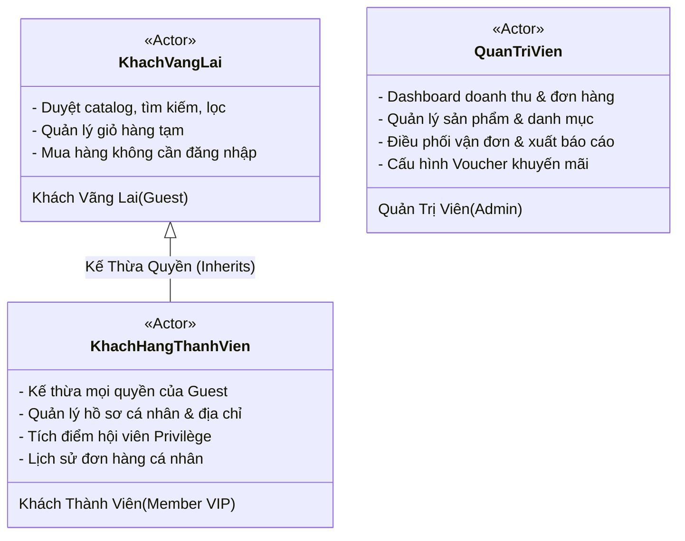
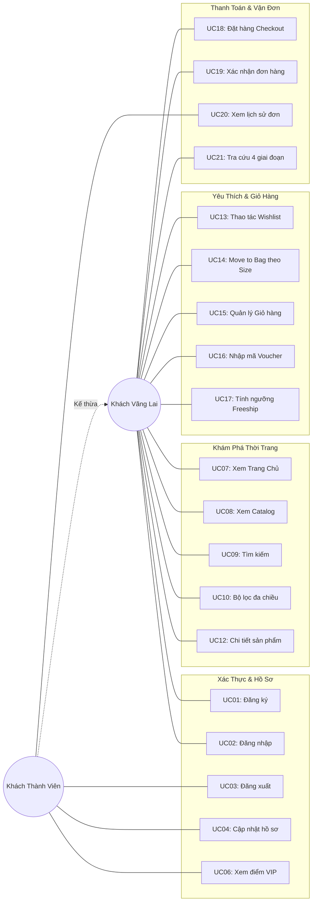
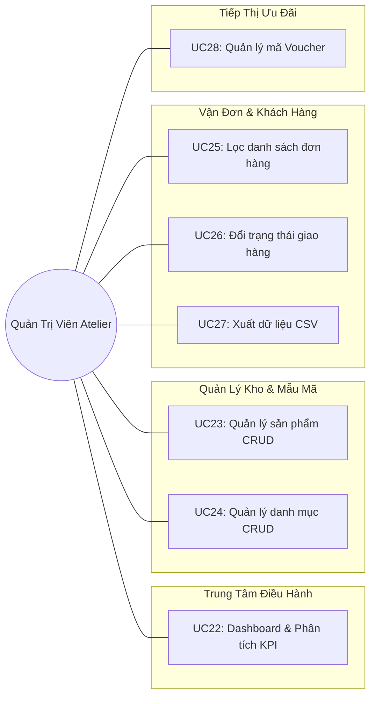

# TÀI LIỆU ĐẶC TẢ PHÂN TÍCH TÁC NHÂN (ACTORS) & CA SỬ DỤNG (USE CASES)
## HỆ THỐNG THƯƠNG MẠI ĐIỆN TỬ THỜI TRANG CAO CẤP — LUNE MAISON

---

## MỤC LỤC TỔNG QUAN

1. [Tổng Quan Hệ Thống & Phạm Vi Phân Tích](#1-tổng-quan-hệ-thống--phạm-vi-phân-tích)
2. [Đặc Tả Chi Tiết Các Tác Nhân (Actors Specification)](#2-đặc-tả-chi-tiết-các-tác-nhân-actors-specification)
3. [Ma Trận Phân Quyền Use Case Toàn Hệ Thống](#3-ma-trận-phân-quyền-use-case-toàn-hệ-thống)
4. [Sơ Đồ Ca Sử Dụng Tổng Thể (Use Case Diagrams)](#4-sơ-đồ-ca-sử-dụng-tổng-thể-use-case-diagrams)
5. [Đặc Tả Chi Tiết 29 Ca Sử Dụng (Use Case Descriptions)](#5-đặc-tả-chi-tiết-29-ca-sử-dụng-use-case-descriptions)
   - [Phân hệ 1: Xác thực & Quản lý Tài khoản (UC01 – UC06)](#phân-hệ-1-xác-thực--quản-lý-tài-khoản)
   - [Phân hệ 2: Khám phá & Tìm kiếm Sản phẩm (UC07 – UC12)](#phân-hệ-2-khám-phá--tìm-kiếm-sản-phẩm)
   - [Phân hệ 3: Yêu thích & Quản lý Giỏ hàng (UC13 – UC17)](#phân-hệ-3-yêu-thích--quản-lý-giỏ-hàng)
   - [Phân hệ 4: Đặt hàng & Theo dõi Vận đơn (UC18 – UC21)](#phân-hệ-4-đặt-hàng--theo-dõi-vận-đơn)
   - [Phân hệ 5: Bộ công cụ Quản trị Atelier (UC22 – UC29)](#phân-hệ-5-bộ-công-cụ-quản-trị-atelier)
6. [Gợi Ý Vấn Đáp & Điểm Nhấn Khi Thuyết Trình](#6-gợi-ý-vấn-đáp--điểm-nhấn-khi-thuyết-trình)

---

## 1. TỔNG QUAN HỆ THỐNG & PHẠM VI PHÂN TÍCH

Hệ thống **LUNE Maison Fashion** được phân tích nghiệp vụ theo phương pháp chuẩn kỹ thuật phần mềm hướng đối tượng (OOAD) và tương tác người dùng (UI/UX).

* **Tổng số Actor (Tác nhân người dùng)**: **3 Tác nhân chính** (+ 1 Tác nhân hệ thống ngoài).
* **Tổng số Use Case (Ca sử dụng)**: **29 Use Cases** hoàn chỉnh.
* **Số phân hệ chức năng**: **5 Phân hệ nghiệp vụ** logic khép kín.
* **Tiêu chuẩn tài liệu**: Phân tích thuần túy nghiệp vụ, luồng hành vi (User Flows), điều kiện tiên quyết, kết quả đầu ra và ngoại lệ — **hoàn toàn không chứa mã nguồn (Zero Code)**.

---

## 2. ĐẶC TẢ CHI TIẾT CÁC TÁC NHÂN (ACTORS SPECIFICATION)

### 2.1. Phân loại & Vai trò các Tác nhân

| STT | Tác nhân (Actor) | Vai trò trong hệ sinh thái LUNE Maison | Mô tả quyền hạn & Trách nhiệm |
| :---: | :--- | :--- | :--- |
| **01** | **Khách vãng lai** *(Guest / Visitor)* | Người mua sắm đại chúng chưa đăng nhập tài khoản. | - Xem thông tin thương hiệu, duyệt bộ sưu tập Thu Đông. - Tìm kiếm, lọc sản phẩm theo màu sắc, kích cỡ, mức giá. - Quản lý giỏ hàng tạm, danh sách yêu thích tạm thời. - Đăng ký tài khoản mới hoặc thanh toán nhanh. |
| **02** | **Khách hàng thành viên** *(Registered Member / VIP Client)* | Khách hàng thân thiết đã có tài khoản định danh trong hệ thống. | - **Kế thừa 100% quyền hạn của Khách vãng lai**. - Quản lý hồ sơ cá nhân và sổ địa chỉ giao hàng. - Tích lũy điểm thưởng *Atelier Privilège Points* và nâng hạng thẻ VIP. - Quản lý và tra cứu lịch sử các đơn hàng đã đặt trong quá khứ. |
| **03** | **Quản trị viên Atelier** *(Atelier Director / Admin)* | Ban quản lý xưởng may và điều hành kinh doanh của thương hiệu. | - Xem các chỉ số KPI doanh thu, biểu đồ phân tích kinh doanh tuần. - Toàn quyền Quản lý sản phẩm (Thêm mới, sửa giá, cập nhật kho, xóa). - Quản lý nhóm danh mục bộ sưu tập. - Điều phối đơn hàng, cập nhật trạng thái vận đơn trực tiếp. - Quản lý chiến dịch mã ưu đãi & Voucher (bật/tắt nhanh). |
| **04** | **Hệ thống Vận tải Ngoài** *(External Logistics - DHL Express)* | Tác nhân hệ thống (Supporting System). | - Cung cấp mã vận đơn bưu phẩm quốc tế và dữ liệu các trạm trung chuyển trong hành trình giao hàng 4 giai đoạn. |

### 2.2. Sơ đồ Kế thừa Tác nhân (Actor Generalization)

---

## 3. MA TRẬN PHÂN QUYỀN USE CASE TOÀN HỆ THỐNG

*(Ký hiệu: `✔` Có quyền thực hiện | `—` Không có quyền)*

| Mã UC | Tên Ca Sử Dụng (Use Case) | Khách vãng lai (Guest) | Khách thành viên (Member) | Quản trị viên (Admin) |
| :---: | :--- | :---: | :---: | :---: |
| **UC01** | Đăng ký tài khoản mới (*Register*) | ✔ | — | — |
| **UC02** | Đăng nhập hệ thống (*Login*) | ✔ | — | ✔ |
| **UC03** | Đăng xuất phiên làm việc (*Logout*) | — | ✔ | ✔ |
| **UC04** | Xem & Cập nhật hồ sơ cá nhân | — | ✔ | — |
| **UC05** | Quản lý sổ địa chỉ giao hàng | — | ✔ | — |
| **UC06** | Xem điểm thưởng & Cấp bậc VIP | — | ✔ | — |
| **UC07** | Xem Trang chủ & Bộ sưu tập mới | ✔ | ✔ | ✔ |
| **UC08** | Duyệt danh mục trang phục (*Catalog*) | ✔ | ✔ | ✔ |
| **UC09** | Tìm kiếm sản phẩm theo từ khóa | ✔ | ✔ | ✔ |
| **UC10** | Lọc sản phẩm theo đa tiêu chí | ✔ | ✔ | ✔ |
| **UC11** | Sắp xếp danh sách sản phẩm | ✔ | ✔ | ✔ |
| **UC12** | Xem trang chi tiết sản phẩm | ✔ | ✔ | ✔ |
| **UC13** | Quản lý danh sách yêu thích (*Wishlist*) | ✔ | ✔ | — |
| **UC14** | Chuyển từ Wishlist vào Giỏ hàng | ✔ | ✔ | — |
| **UC15** | Xem & Điều chỉnh số lượng giỏ hàng | ✔ | ✔ | — |
| **UC16** | Áp dụng mã giảm giá (*Voucher*) | ✔ | ✔ | — |
| **UC17** | Ước tính cước phí & Ngưỡng Freeship | ✔ | ✔ | — |
| **UC18** | Điền thông tin & Đặt hàng (*Checkout*) | ✔ | ✔ | — |
| **UC19** | Nhận thông báo xác nhận đơn hàng | ✔ | ✔ | — |
| **UC20** | Xem lịch sử đơn hàng đã đặt | — | ✔ | — |
| **UC21** | Tra cứu hành trình bưu phẩm (*Tracking*) | ✔ | ✔ | ✔ |
| **UC22** | Xem Dashboard phân tích & Doanh thu | — | — | ✔ |
| **UC23** | Quản lý sản phẩm may mặc (*CRUD Products*) | — | — | ✔ |
| **UC24** | Quản lý nhóm danh mục (*CRUD Categories*) | — | — | ✔ |
| **UC25** | Quản lý & Lọc danh sách đơn đặt hàng | — | — | ✔ |
| **UC26** | Cập nhật trạng thái vận chuyển đơn hàng | — | — | ✔ |
| **UC27** | Xuất báo cáo đơn hàng ra tệp CSV | — | — | ✔ |
| **UC28** | Quản lý chiến dịch mã ưu đãi Voucher | — | — | ✔ |
| **UC29** | Xem thông tin thương hiệu & Showroom | ✔ | ✔ | ✔ |

---

## 4. SƠ ĐỒ CA SỬ DỤNG TỔNG THỂ (USE CASE DIAGRAMS)

### 4.1. Sơ đồ Phân hệ Khách hàng (Storefront Use Cases)

### 4.2. Sơ đồ Phân hệ Quản trị Viên (Admin Suite Use Cases)

---

## 5. ĐẶC TẢ CHI TIẾT 29 CA SỬ DỤNG (USE CASE DESCRIPTIONS)

---

### PHÂN HỆ 1: XÁC THỰC & QUẢN LÝ TÀI KHOẢN

#### UC01: Đăng ký tài khoản mới (Register)
* **Tác nhân**: Khách vãng lai.
* **Mục tiêu**: Tạo tài khoản cá nhân mới để hưởng đặc quyền hội viên.
* **Tiền điều kiện**: Người dùng chưa đăng nhập hệ thống.
* **Luồng chính**:
  1. Người dùng truy cập trang Đăng ký (`/register`).
  2. Điền thông tin: Họ tên, Email, Mật khẩu, Xác nhận mật khẩu.
  3. Bấm chọn đồng ý với điều khoản thành viên và nhấn *"Create Atelier Account"*.
  4. Hệ thống kiểm tra tính hợp lệ của dữ liệu, tạo tài khoản và chuyển hướng người dùng sang trạng thái đã đăng nhập.
* **Luồng ngoại lệ**: Nếu email đã tồn tại trong hệ thống hoặc mật khẩu xác nhận không khớp, hệ thống thông báo lỗi tại trường tương ứng.

#### UC02: Đăng nhập hệ thống (Login)
* **Tác nhân**: Khách vãng lai, Quản trị viên.
* **Mục tiêu**: Xác thực danh tính người dùng để mở quyền truy cập tài nguyên bảo mật.
* **Tiền điều kiện**: Người dùng đã có tài khoản trong hệ thống.
* **Luồng chính**:
  1. Người dùng mở trang Đăng nhập (`/login`).
  2. Điền thông tin Email và Mật khẩu (hoặc chọn Đăng nhập bằng Google/Apple).
  3. Nhấn *"Sign In to Atelier"*.
  4. Hệ thống xác thực danh tính: Điều hướng Khách hàng về trang cá nhân/trang chủ; điều hướng Quản trị viên về trang Dashboard.
* **Luồng ngoại lệ**: Sai email hoặc sai mật khẩu, hệ thống hiển thị cảnh báo từ chối truy cập.

#### UC03: Đăng xuất phiên làm việc (Logout)
* **Tác nhân**: Khách thành viên, Quản trị viên.
* **Mục tiêu**: Kết thúc phiên làm việc an toàn, xóa bỏ thông tin định danh trên thiết bị.
* **Tiền điều kiện**: Người dùng đang ở trạng thái đăng nhập.
* **Luồng chính**:
  1. Người dùng chọn nút *"Sign Out"* trên thanh Menu hoặc trang Hồ sơ cá nhân.
  2. Hệ thống thu hồi phiên đăng nhập và đưa người dùng về Trang chủ dưới quyền Khách vãng lai.

#### UC04: Xem & Cập nhật hồ sơ cá nhân (Edit Profile)
* **Tác nhân**: Khách hàng thành viên.
* **Mục tiêu**: Quản lý thông tin liên hệ và sở thích cá nhân.
* **Tiền điều kiện**: Đã đăng nhập vào tài khoản.
* **Luồng chính**:
  1. Người dùng truy cập trang Hồ sơ (`/profile`), chọn tab *Personal Details*.
  2. Chỉnh sửa Họ tên, Số điện thoại hoặc Ngày sinh.
  3. Nhấn *"Save Changes"*.
  4. Hệ thống lưu trữ dữ liệu mới và hiển thị thông báo Toast xác nhận thành công.

#### UC05: Quản lý sổ địa chỉ giao hàng (Manage Addresses)
* **Tác nhân**: Khách hàng thành viên.
* **Mục tiêu**: Cấu hình địa chỉ nhận hàng mặc định giúp đẩy nhanh thao tác thanh toán.
* **Tiền điều kiện**: Đã đăng nhập.
* **Luồng chính**:
  1. Người dùng vào tab *Shipping Addresses* trong trang cá nhân.
  2. Thêm mới hoặc chỉnh sửa Số nhà, Đường, Thành phố và Mã bưu chính.
  3. Lưu lại thông tin để hệ thống tự động điền sẵn tại trang Checkout.

#### UC06: Xem điểm thưởng & Cấp bậc VIP (View Loyalty Points & Tier)
* **Tác nhân**: Khách hàng thành viên.
* **Mục tiêu**: Theo dõi điểm tích lũy và quyền lợi của hạng thẻ hội viên.
* **Tiền điều kiện**: Đã đăng nhập.
* **Luồng chính**:
  1. Người dùng xem thẻ nhận diện *Profile Hero Card*.
  2. Hệ thống hiển thị: Cấp bậc thẻ (*VIP Privilège Member*), số điểm hiện có (ví dụ `1,250 Points`) và ngày gia nhập xưởng may.

---

### PHÂN HỆ 2: KHÁM PHÁ & TÌM KIẾM SẢN PHẨM

#### UC07: Xem Trang chủ & Bộ sưu tập mới (View Homepage)
* **Tác nhân**: Mọi người dùng.
* **Mục tiêu**: Tiếp cận định vị thương hiệu và các xu hướng thời trang nổi bật nhất.
* **Luồng chính**:
  1. Người dùng mở trang chủ (`/`).
  2. Quan sát hình ảnh Hero Banner, các bộ sưu tập theo mùa, danh mục nổi bật và khối bài viết triết lý thời trang.
  3. Nhấp vào các liên kết điều hướng đến trang Cửa hàng.

#### UC08: Duyệt danh mục trang phục (Browse Catalog)
* **Tác nhân**: Mọi người dùng.
* **Mục tiêu**: Khám phá danh sách đầy đủ các mẫu thiết kế của thương hiệu.
* **Luồng chính**:
  1. Người dùng mở trang Cửa hàng (`/shop`).
  2. Hệ thống tải toàn bộ danh mục sản phẩm thời trang theo lưới trực quan kèm nhãn *New Arrival, Bestseller*.

#### UC09: Tìm kiếm sản phẩm theo từ khóa (Search Products)
* **Tác nhân**: Mọi người dùng.
* **Mục tiêu**: Định vị nhanh món đồ thời trang mong muốn.
* **Luồng chính**:
  1. Nhập từ khóa (ví dụ: *"Coat"*, *"Silk"*, *"Blazer"*) vào thanh tìm kiếm.
  2. Hệ thống lập tức đối chiếu tên và mô tả sản phẩm để trả về kết quả tương ứng.
* **Luồng ngoại lệ**: Không tìm thấy sản phẩm phù hợp, hệ thống hiển thị thông báo *"No garments found"* kèm gợi ý thử lại từ khóa khác.

#### UC10: Lọc sản phẩm đa tiêu chí (Filter Products)
* **Tác nhân**: Mọi người dùng.
* **Mục tiêu**: Thu hẹp phạm vi sản phẩm theo tiêu chuẩn kích cỡ, ngân sách và sở thích màu sắc.
* **Luồng chính**:
  1. Người dùng chọn một hoặc nhiều điều kiện:
     - Phân loại (Outerwear, Dresses, Tailoring,...)
     - Kích cỡ (XS, S, M, L, XL)
     - Bảng màu vải (Caramel, Beige, Espresso,...)
     - Khoảng giá tối đa qua thanh trượt Slider.
  2. Hệ thống tự động lọc và cập nhật danh sách hiển thị tức thời mà không cần tải lại trang.

#### UC11: Sắp xếp danh sách sản phẩm (Sort Products)
* **Tác nhân**: Mọi người dùng.
* **Mục tiêu**: Thay đổi thứ tự ưu tiên hiển thị của sản phẩm.
* **Luồng chính**:
  1. Người dùng chọn tiêu chí sắp xếp: Giá thấp đến cao, Giá cao đến thấp, Mới nhất, hoặc Bán chạy nhất.
  2. Lưới sản phẩm tái sắp xếp theo đúng quy luật được chọn.

#### UC12: Xem chi tiết sản phẩm (View Product Details)
* **Tác nhân**: Mọi người dùng.
* **Mục tiêu**: Đánh giá toàn diện món đồ trước khi quyết định mua hàng.
* **Luồng chính**:
  1. Người dùng nhấp vào một thẻ sản phẩm.
  2. Hệ thống chuyển sang trang Chi tiết (`/product/:id`).
  3. Người dùng phóng to ảnh cận cảnh chất liệu vải, xem bảng thông số Size Guide, đọc nhận xét của người mua trước và xem các món đồ phối kèm (Complete The Look).

---

### PHÂN HỆ 3: YÊU THÍCH & QUẢN LÝ GIỎ HÀNG

#### UC13: Quản lý danh sách yêu thích (Wishlist Management)
* **Tác nhân**: Khách vãng lai, Khách thành viên.
* **Mục tiêu**: Lưu lại những thiết kế ưng ý để cân nhắc mua sau.
* **Luồng chính**:
  1. Người dùng nhấp vào biểu tượng **Trái tim** trên ảnh sản phẩm.
  2. **Cơ chế Toggle**: Nếu sản phẩm chưa có trong danh sách -> Thêm vào; Nếu đã có -> Xóa ra khỏi danh sách.
  3. Số đếm huy hiệu (Badge) trên thanh Menu tự động cập nhật ngay lập tức.
  4. Người dùng có thể vào trang `/wishlist` để xem toàn bộ đồ đã lưu hoặc nhấn icon Thùng rác để xóa bỏ từng món.

#### UC14: Chuyển từ Wishlist vào Giỏ hàng (Move to Bag with Size)
* **Tác nhân**: Khách vãng lai, Khách thành viên.
* **Mục tiêu**: Đưa món đồ từ danh sách ước muốn vào giỏ hàng phục vụ việc thanh toán.
* **Đặc thù nghiệp vụ**: Quần áo may đo bắt buộc phải xác định Size trước khi đặt mua.
* **Luồng chính**:
  1. Tại trang Wishlist, người dùng nhấn nút *"Select Size & Move to Bag"*.
  2. Hệ thống điều hướng người dùng tới trang Chi tiết sản phẩm.
  3. Người dùng chọn kích cỡ mong muốn (`S/M/L`) và màu sắc.
  4. Nhấn *"Add to Bag"*; món đồ chính thức được đưa vào giỏ hàng.

#### UC15: Xem & Điều chỉnh giỏ hàng (Cart Management)
* **Tác nhân**: Khách vãng lai, Khách thành viên.
* **Mục tiêu**: Kiểm tra, sửa đổi số lượng món đồ trước khi đặt hàng.
* **Đặc thù nghiệp vụ**: **Định danh sản phẩm = ID + Kích cỡ**. Cùng một mẫu áo nếu mua 2 kích cỡ khác nhau sẽ được tách thành 2 dòng riêng biệt.
* **Luồng chính**:
  1. Người dùng mở trang Giỏ hàng (`/cart`).
  2. Bấm nút `+` hoặc `-` để tăng/giảm số lượng món đồ (tiền tự động nhân lên theo đơn giá).
  3. Bấm icon Thùng rác để xóa hẳn một món đồ khỏi giỏ.
* **Luồng ngoại lệ (Empty State)**: Khi xóa hết toàn bộ đồ, hệ thống hiển thị màn hình giỏ rỗng dịu dàng và tự động khóa (disable) nút *"Proceed to Checkout"*.

#### UC16: Áp dụng mã ưu đãi (Apply Privilege Voucher)
* **Tác nhân**: Khách vãng lai, Khách thành viên.
* **Mục tiêu**: Hưởng chiết khấu đặc quyền bằng mã khuyến mãi.
* **Luồng chính**:
  1. Người dùng nhập mã giảm giá (ví dụ: `AUTUMN2026`) vào ô nhập mã tại trang Giỏ hàng.
  2. Nhấn nút **"APPLY"**.
  3. Hệ thống kiểm tra điều kiện:
     - Nếu mã hợp lệ và đơn đạt mức chi tiêu tối thiểu (`minSpend`) -> Hiển thị dòng giảm giá (Discount) và trừ trực tiếp vào tổng tiền thanh toán.
* **Luồng ngoại lệ**: Nếu mã không tồn tại, hết hạn hoặc đơn hàng chưa đạt giá trị tối thiểu, hệ thống hiển thị cảnh báo lỗi cụ thể.

#### UC17: Ước tính cước phí & Ngưỡng Freeship (Calculate Shipping)
* **Tác nhân**: Khách vãng lai, Khách thành viên.
* **Mục tiêu**: Minh bạch hóa toàn bộ chi phí vận chuyển quốc tế.
* **Luồng chính**:
  1. Hệ thống tự động so sánh Tạm tính (Subtotal) với ngưỡng miễn phí vận chuyển $250.
  2. Nếu $Subtotal > \$250$ -> Cước vận chuyển tự động chuyển thành **"COMPLIMENTARY"** ($0).
  3. Nếu $Subtotal \le \$250$ -> Tính cước vận chuyển tiêu chuẩn cố định là **$25**.

---

### PHÂN HỆ 4: ĐẶT HÀNG & THEO DÕI VẬN ĐƠN

#### UC18: Điền thông tin & Đặt hàng (Checkout)
* **Tác nhân**: Khách vãng lai, Khách thành viên.
* **Mục tiêu**: Cung cấp địa chỉ giao nhận và hoàn tất hợp đồng mua bán điện tử.
* **Tiền điều kiện**: Giỏ hàng có ít nhất 1 sản phẩm.
* **Luồng chính**:
  1. Tại giỏ hàng, người dùng nhấn *"Proceed to Checkout"*.
  2. Điền thông tin Email liên hệ, Họ tên người nhận, Địa chỉ nhận hàng, Thành phố và Mã bưu cục.
  3. Xem lại cột tóm lược đơn hàng (Sticky Summary) bên phải để xác nhận tổng tiền.
  4. Nhấn nút **"COMPLETE ORDER"**.

#### UC19: Nhận thông báo xác nhận đơn hàng (Order Confirmation)
* **Tác nhân**: Khách vãng lai, Khách thành viên.
* **Mục tiêu**: Nhận bảo chứng mua hàng thành công và mã vận đơn chính thức.
* **Luồng chính**:
  1. Sau khi bấm hoàn tất, hệ thống chuyển sang màn hình chúc mừng.
  2. Hiển thị thông điệp tri ân *"Merci Beaucoup"*, cấp mã định danh đơn hàng độc nhất dạng `#LUNE-2026-xxxx` và nhắc nhở khách hàng kiểm tra email.

#### UC20: Xem lịch sử đơn hàng đã đặt (View Order History)
* **Tác nhân**: Khách hàng thành viên.
* **Mục tiêu**: Quản lý chi tiêu và kiểm tra trạng thái các đơn hàng cũ.
* **Tiền điều kiện**: Đã đăng nhập tài khoản.
* **Luồng chính**:
  1. Người dùng truy cập trang Cá nhân (`/profile`), chọn tab *Order History*.
  2. Hệ thống liệt kê toàn bộ danh sách đơn: Mã đơn, Ngày mua, Giá trị đơn, Trạng thái (*Processing, In Transit, Delivered*).
  3. Người dùng có thể nhấn liên kết *"Track Order"* để kiểm tra chi tiết.

#### UC21: Tra cứu hành trình bưu phẩm (Order Tracking)
* **Tác nhân**: Mọi người dùng.
* **Mục tiêu**: Minh bạch hóa toàn bộ tiến trình may đo và vận chuyển bưu phẩm quốc tế.
* **Luồng chính**:
  1. Người dùng mở trang Tra cứu (`/order-tracking`).
  2. Nhập mã số đơn hàng vào ô tìm kiếm và bấm nút Kính lúp.
  3. Hệ thống hiển thị biểu đồ đồ họa **Tiến trình 4 giai đoạn**:
     - *Giai đoạn 1*: Đơn hàng xác nhận & chuyển tiếp xưởng may.
     - *Giai đoạn 2*: Thợ thủ công may đo, ủi nhiệt & đóng gói hộp quà đặc quyền.
     - *Giai đoạn 3*: Xuất xưởng và vận chuyển hàng không quốc tế (DHL Express).
     - *Giai đoạn 4*: Phát tận tay người nhận với chữ ký bảo chứng.
  4. Hiển thị thông tin ngày giờ chi tiết tại từng mốc và ngày giao dự kiến.

---

### PHÂN HỆ 5: BỘ CÔNG CỤ QUẢN TRỊ ATELIER

#### UC22: Xem Dashboard phân tích & Doanh thu (Admin Dashboard)
* **Tác nhân**: Quản trị viên Atelier.
* **Mục tiêu**: Nắm bắt nhanh bức tranh tài chính và tiến độ kinh doanh của thương hiệu.
* **Luồng chính**:
  1. Quản trị viên truy cập trang `/admin`.
  2. Hệ thống tải dữ liệu:
     - 4 thẻ KPI: Tổng doanh thu gộp, Tổng số đơn hàng, Số mẫu đang kinh doanh, Khách hàng mới (kèm % tăng trưởng).
     - Biểu đồ cột phân tích doanh thu 7 ngày trong tuần.
     - Bảng danh sách 5 đơn hàng mới nhất cần duyệt.
     - Danh sách các mẫu thiết kế bán chạy nhất kèm cảnh báo tồn kho.

#### UC23: Quản lý sản phẩm may mặc (CRUD Products)
* **Tác nhân**: Quản trị viên Atelier.
* **Mục tiêu**: Kiểm soát danh mục hàng may mặc đang bán ngoài website.
* **Luồng chính**:
  1. Truy cập trang `/admin/products`.
  2. **Thêm mới**: Nhấn `+ NEW GARMENT`, điền tên, chọn danh mục, giá, tồn kho, ảnh đại diện và bấm Lưu.
  3. **Chỉnh sửa**: Nhấn biểu tượng Bút chì tại món đồ cần sửa, cập nhật giá hoặc số lượng tồn kho mới rồi lưu lại.
  4. **Xóa**: Nhấn biểu tượng Thùng rác để gỡ bỏ mẫu trang phục khỏi hệ thống.
  5. Hệ thống hiển thị thông báo Toast xác nhận thao tác thành công.

#### UC24: Quản lý nhóm danh mục (CRUD Categories)
* **Tác nhân**: Quản trị viên Atelier.
* **Mục tiêu**: Cơ cấu các bộ sưu tập theo mùa hoặc theo dòng trang phục.
* **Luồng chính**:
  1. Truy cập trang `/admin/categories`.
  2. Xem danh sách các nhóm hiện tại kèm số lượng sản phẩm trực thuộc.
  3. Nhấn `+ NEW CATEGORY` để tạo phân loại thời trang mới (nhập tên, ảnh bìa, mô tả phong cách).

#### UC25: Quản lý & Lọc danh sách đơn đặt hàng (Manage Orders)
* **Tác nhân**: Quản trị viên Atelier.
* **Mục tiêu**: Kiểm soát và theo dõi toàn bộ các đơn đặt hàng phát sinh.
* **Luồng chính**:
  1. Truy cập trang `/admin/orders`.
  2. Nhập từ khóa tìm kiếm theo: Mã đơn, Tên khách hàng hoặc Email.
  3. Sử dụng bộ lọc trạng thái: *All, Pending, Processing, In Transit, Delivered, Cancelled*.

#### UC26: Cập nhật trạng thái vận chuyển đơn hàng (Update Order Status)
* **Tác nhân**: Quản trị viên Atelier.
* **Mục tiêu**: Điều phối quy trình đóng gói và bàn giao bưu phẩm cho đơn vị chuyển phát.
* **Luồng chính**:
  1. Tại bảng danh sách đơn hàng, quản trị viên nhấp vào Menu thả xuống (Dropdown) ở cột *Fulfillment Status*.
  2. Chọn trạng thái mới (ví dụ chuyển từ `Pending` sang `In Transit`).
  3. Hệ thống tự động ghi nhận và đồng bộ thời gian thực sang trang Tra cứu của khách hàng.

#### UC27: Xuất báo cáo đơn hàng ra tệp CSV (Export Orders CSV)
* **Tác nhân**: Quản trị viên Atelier.
* **Mục tiêu**: Trích xuất dữ liệu phục vụ kế toán, đối soát vận chuyển và lưu trữ nội bộ.
* **Luồng chính**:
  1. Quản trị viên nhấn nút **"Export CSV"** trên thanh công cụ.
  2. Hệ thống tổng hợp toàn bộ danh sách đơn và xuất ra tệp dữ liệu bảng tính.

#### UC28: Quản lý chiến dịch mã ưu đãi Voucher (Manage Promotions)
* **Tác nhân**: Quản trị viên Atelier.
* **Mục tiêu**: Khởi tạo và kiểm soát các chương trình khuyến mãi kích cầu mua sắm.
* **Luồng chính**:
  1. Truy cập trang `/admin/promotions`.
  2. **Tạo mã mới**: Nhấn `+ NEW PROMOTION`, đặt mã code, chọn hình thức chiết khấu (% hoặc Freeship), giá trị đơn tối thiểu và thời hạn áp dụng.
  3. **Bật/Tắt hiệu lực**: Gạt công tắc **Active Toggle Switch** để tạm dừng hoặc kích hoạt lại mã giảm giá ngay tức khắc.

#### UC29: Xem thông tin thương hiệu & Showroom (About & Concierge)
* **Tác nhân**: Mọi người dùng.
* **Mục tiêu**: Tiếp cận thông tin nguồn gốc chất liệu cao cấp và dịch vụ chăm sóc khách hàng độc quyền.
* **Luồng chính**:
  1. Người dùng mở trang `/about`.
  2. Đọc nội dung về di sản xưởng may LUNE, cam kết thủ công không rác thải nhựa và thông tin liên hệ các phòng trưng bày tại Paris, Milan, Tokyo, New York.

---

## 6. GỢI Ý VẤN ĐÁP & ĐIỂM NHẤN KHI THUYẾT TRÌNH

Khi thầy cô hoặc ban giám khảo hỏi về cấu trúc hệ thống, bạn có thể tự tin trả lời dựa trên các luận điểm sau:

1. **Về kiến trúc phân quyền (Actor Architecture)**:
   * *"Hệ thống của em phân định 3 Actor rất rành mạch: Khách vãng lai, Khách thành viên (kế thừa toàn bộ quyền của Khách vãng lai cộng thêm các tính năng cá nhân hóa như tích điểm VIP và xem đơn cũ), và Quản trị viên điều hành Atelier."*
2. **Về xử lý nghiệp vụ thời trang may mặc đặc thù (Fashion Business Logic)**:
   * *"Trong giỏ hàng, hệ thống định danh sản phẩm bằng cặp `ID + Size` để đảm bảo nếu khách mua cùng 1 áo nhưng 2 size khác nhau thì hệ thống sẽ tự động tách thành 2 dòng riêng biệt chứ không cộng dồn số lượng."*
   * *"Ở danh sách Wishlist, em xây dựng luồng `Move to Bag` bắt buộc điều hướng khách chọn Size chuẩn trước khi bỏ vào giỏ hàng nhằm tránh lỗi sai lệch kích cỡ khi giao nhận."*
3. **Về tính toán tài chính & Khuyến mãi (Order Economics)**:
   * *"Giỏ hàng được lập trình cơ chế Freeship tự động nếu đơn hàng vượt ngưỡng $250, và mã Voucher chỉ được kích hoạt khi đạt giá trị chi tiêu tối thiểu `minSpend`."*
4. **Về tính đồng bộ khép kín (Full-cycle Lifecycle)**:
   * *"Khi Quản trị viên cập nhật trạng thái đơn hàng từ `Pending` sang `In Transit` trong trang Admin, khách hàng có thể dùng mã đơn đó tra cứu ngay lập tức trên trang Order Tracking với tiến trình 4 giai đoạn minh bạch."*
